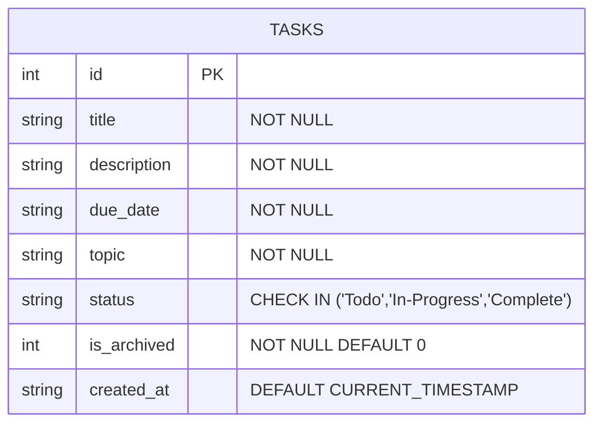
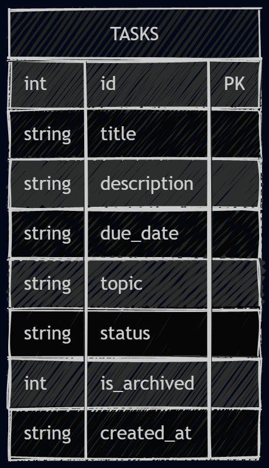

# Database Design

## ERD for the tasks table

For this lab, the ERD is intentionally simple because the app uses a single SQLite table: `tasks`.
There are no relationships to other tables, so the correct ERD is a single entity with its columns and constraints.

## How to draw this ERD

### Option 1: Mermaid Live Editor
1. Open https://mermaid.live/ in your browser.
2. Paste the Mermaid code block above into the editor.
3. Click the "Generate Diagram" or "Render" button.
4. Export the diagram as SVG or PNG if needed.

