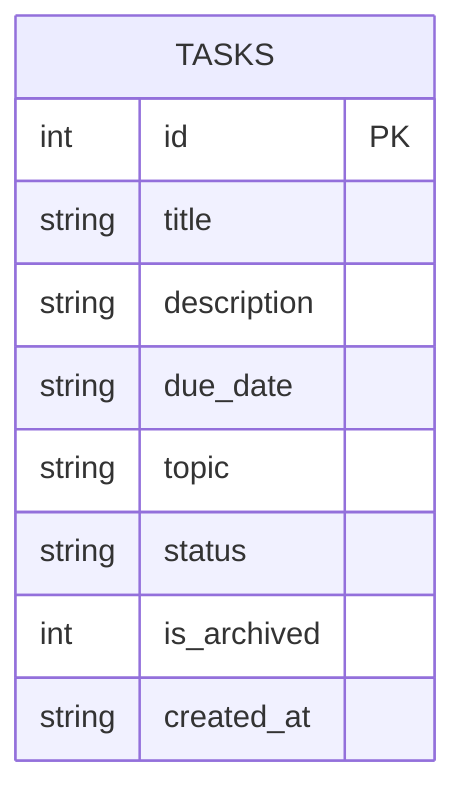
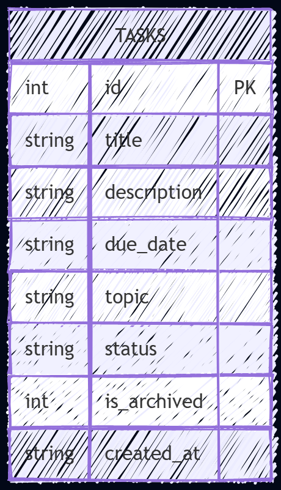

# Database Design

## ERD for the tasks table

## How to draw this ERD

### Option 1: Mermaid Live Editor
1. Open https://mermaid.live/ in your browser.
2. Paste the Mermaid code block above into the editor.
3. Click the "Generate Diagram" or "Render" button.
4. Export the diagram as SVG or PNG if needed.

### Option 2: Draw.io
1. Open Draw.io and create a new blank diagram.
2. Add an Entity shape for the `tasks` table.
3. Add attributes inside the entity: `id`, `title`, `description`, `due_date`, `topic`, `status`, `is_archived`, and `created_at`.
4. Label the entity as `TASKS` and group the properties in a simple table-style layout.
5. Save the diagram as a Draw.io file or export it as an image.

### Option 3: Mermaid in VS Code
1. Install the Mermaid Markdown Preview or Markdown Preview Enhanced extension in VS Code.
2. Open this markdown file.
3. Open the preview pane to render the Mermaid diagram.
4. Use the preview to review or export the ERD.
